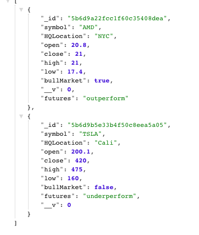

# API

This repo demonstrates a RESTful API.
The schema returns stock symbol, HQ location, and futures as string data;
open, close, high, and low as number data, and whether it is a bull market as boolean. 

